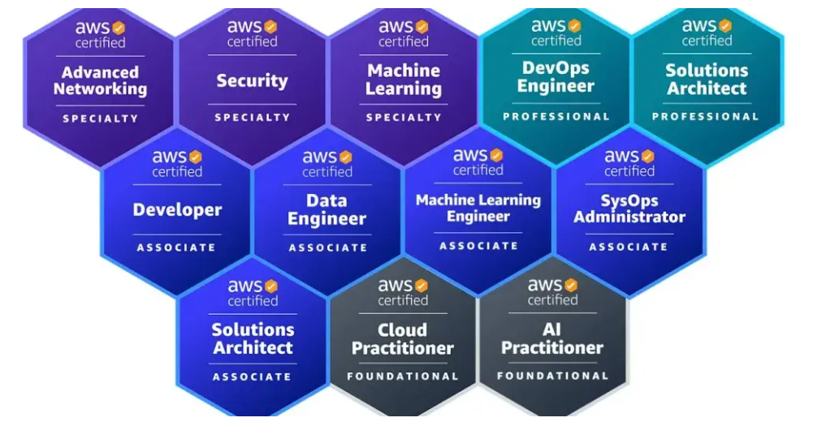

<h1 align="center">AWS Hub ☁️</h1>

Bem-vindo ao repositório AWS Hub 👋

Seja você um novo membro da comunidade AWS, um desenvolvedor ou engenheiro de nuvem em busca de um hub centralizado de recursos sobre AWS, este repositório é para você. Ele reúne projetos reais, materiais de certificação, documentação de serviços AWS e insights de arquitetura. Considere este repositório como seu ponto de referência para aprender e aplicar conhecimentos em AWS. 🔥

## Começando 🚀

- **O que é AWS?** | Amazon Web Services: ➡️ [**Assista aqui**](https://youtu.be/a9__D53WsUs)
- **Documentação da AWS:** 📖 [**Explore aqui**](https://docs.aws.amazon.com)
- **Serviços mais importantes:** ➡️ [**Assista aqui**](https://youtu.be/FDEpdNdFglI)
- **Mais de 50 serviços AWS explicados em 10 minutos:** ➡️ [**Assista aqui**](https://youtu.be/JIbIYCM48to) (por **Fireship**)
- **Arquitetura AWS:** 📖 [**Explore aqui**](https://aws.amazon.com/architecture)
- **Console de Gerenciamento AWS:** [**Explore aqui**](https://aws.amazon.com/console/)

## Recursos de Aprendizado de Serviços AWS 📘

Esta seção fornece links para documentação detalhada, vídeos introdutórios e FAQs dos serviços populares da AWS.

- **Total de serviços cobertos:** **100**
- **Documentação AWS:** Documentação oficial para cada serviço
- **FAQs da AWS:** Perguntas frequentes sobre os serviços AWS
- **Introdução (YouTube):** Vídeos curtos (~2min) com animações, música e diagramas  

### Tabela Completa de Recursos de Aprendizado de Serviços AWS

#### Computação

| ID  | Nome do Serviço               | Documentação AWS | Introdução | Perguntas Frequentes AWS |
|-----|-------------------------------|------------------|------------|--------------------------|
| 1   | Amazon EC2                    | 📖 [ec2](https://docs.aws.amazon.com/ec2) | ▶️ [Assistir](https://youtu.be/TsRBftzZsQo) | ❔ [ec2/faqs](https://aws.amazon.com/ec2/faqs/)|
| 2   | Amazon Lightsail              | 📖 [lightsail](https://docs.aws.amazon.com/lightsail) | ▶️ [Assistir](https://youtu.be/wzhTAwRbdXw) | ❔ [lightsail/faqs](https://aws.amazon.com/lightsail/faq/)|
| 3   | AWS Lambda                    | 📖 [lambda](https://docs.aws.amazon.com/lambda) | ▶️ [Assistir](https://youtu.be/eOBq__h4OJ4) | ❔ [lambda/faqs](https://aws.amazon.com/lambda/faqs/)|
| 4   | Amazon Elastic Beanstalk      | 📖 [elasticbeanstalk](https://docs.aws.amazon.com/elasticbeanstalk/latest/dg/Welcome.html) | ▶️ [Assistir](https://youtu.be/uiM1xzOX8Qg) | ❔ [elasticbeanstalk/faqs](https://aws.amazon.com/elasticbeanstalk/faqs/)|
| 5   | Amazon EC2 Auto Scaling       | 📖 [autoscaling](https://docs.aws.amazon.com/autoscaling) | ▶️ [Assistir](https://youtu.be/oglXFzUIPJQ) | ❔ [autoscaling/faqs](https://aws.amazon.com/autoscaling/faqs/)|
| 6   | AWS Fargate                   | 📖 [fargate](https://docs.aws.amazon.com/AmazonECS/latest/developerguide/AWS_Fargate.html) | ▶️ [Assistir](https://youtu.be/4CHu1ErN51o) | ❔ [fargate/faqs](https://aws.amazon.com/fargate/faqs/)|
| 7   | Amazon EKS                    | 📖 [eks](https://docs.aws.amazon.com/eks) | ▶️ [Assistir](https://youtu.be/XeRgIo9XM5w) | ❔ [eks/faqs](https://aws.amazon.com/eks/faqs/)|
| 8   | Amazon ECS                    | 📖 [ecs](https://docs.aws.amazon.com/ecs) | ▶️ [Assistir](https://youtu.be/FnFvpIsBrog) | ❔ [ecs/faqs](https://aws.amazon.com/ecs/faqs/)|
| 9   | Amazon EMR                    | 📖 [emr](https://docs.aws.amazon.com/emr) | ▶️ [Assistir](https://youtu.be/Xw_T-hlCrBw) | ❔ [emr/faqs](https://aws.amazon.com/emr/faqs/)|
| 10  | Amazon Batch                  | 📖 [batch](https://docs.aws.amazon.com/batch) | ▶️ [Assistir](https://youtu.be/j_iI1DzSi5g) | ❔ [batch/faqs](https://aws.amazon.com/batch/faqs/)|

#### Armazenamento

| ID  | Nome do Serviço               | Documentação AWS | Introdução | Perguntas Frequentes AWS |
|-----|-------------------------------|------------------|------------|--------------------------|
| 11  | Amazon S3                     | 📖 [s3](https://docs.aws.amazon.com/s3) | ▶️ [Assistir](https://youtu.be/ecv-19sYL3w) | ❔ [s3/faqs](https://aws.amazon.com/s3/faqs/)|
| 12  | Amazon EBS                    | 📖 [ebs](https://docs.aws.amazon.com/ebs) | ▶️ [Assistir](https://youtu.be/77qLAl-lRpo) | ❔ [ebs/faqs](https://aws.amazon.com/ebs/faqs/)|
| 13  | Amazon EFS                    | 📖 [efs](https://docs.aws.amazon.com/efs) | ▶️ [Assistir](https://youtu.be/vAV4ASDnbN0) | ❔ [efs/faqs](https://aws.amazon.com/pt/efs/faq/)|
| 14  | Amazon FSx                    | 📖 [fsx](https://docs.aws.amazon.com/fsx) | ▶️ [Assistir](https://youtu.be/2MefyahWOq4) | ❔ [fsx/faqs](https://aws.amazon.com/pt/fsx/windows/faqs/)|
| 15  | Amazon Glacier                | 📖 [glacier](https://docs.aws.amazon.com/glacier) | ▶️ [Assistir](https://youtu.be/gMzVi7Z8zBo) | ❔ [glacier/faqs](https://aws.amazon.com/glacier/faqs/)|
| 16  | AWS Backup                    | 📖 [backup](https://docs.aws.amazon.com/aws-backup/) | ▶️ [Assistir](https://youtu.be/xD0FRjY9ujY) | ❔ [backup/faqs](https://aws.amazon.com/backup/faqs/)|
| 17  | Amazon S3 Glacier Deep Archive| 📖 [s3glacier](https://docs.aws.amazon.com/AmazonS3/latest/userguide/glacier-storage-classes.html) | ▶️ [Assistir](https://youtu.be/XA-pZaDLTqY) | ❔ [s3glacier/faqs](https://aws.amazon.com/glacier/faqs/)|
| 18  | AWS Snowball                  | 📖 [snowball](https://docs.aws.amazon.com/snowball) | ▶️ [Assistir](https://youtu.be/bxSD1Nha2k8) | ❔ [snowball/faqs](https://aws.amazon.com/snowball/faqs/)|
| 19  | AWS Storage Gateway           | 📖 [storagegateway](https://docs.aws.amazon.com/storagegateway) | ▶️ [Assistir](https://youtu.be/XXQNXwx8nfE) | ❔ [storagegateway/faqs](https://aws.amazon.com/storagegateway/faqs/)|
| 20  | Amazon Elastic File System (EFS)| 📖 [efs](https://docs.aws.amazon.com/efs) | ▶️ [Assistir](https://youtu.be/vAV4ASDnbN0) | ❔ [efs/faqs](https://aws.amazon.com/pt/efs/faq/)|
#### Banco de Dados

| ID  | Nome do Serviço                  | Documentação AWS | Introdução | Perguntas Frequentes AWS |
|-----|----------------------------------|------------------|------------|--------------------------|
| 21  | Amazon RDS                       | 📖 [rds](https://docs.aws.amazon.com/rds) | ▶️ [Assistir](https://youtu.be/GvUaA9cygUk) | ❔ [rds/faqs](https://aws.amazon.com/rds/faqs/)|
| 22  | Amazon DynamoDB                  | 📖 [dynamodb](https://docs.aws.amazon.com/dynamodb) | ▶️ [Assistir](https://youtu.be/sI-zciHAh-4) | ❔ [dynamodb/faqs](https://aws.amazon.com/dynamodb/faqs/)|
| 23  | Amazon Aurora                    | 📖 [aurora](https://docs.aws.amazon.com/pt_br/AmazonRDS/latest/AuroraUserGuide/CHAP_AuroraOverview.html) | ▶️ [Assistir](https://youtu.be/xKFA6PJgp0o) | ❔ [aurora/faqs](https://aws.amazon.com/aurora/faqs/)|
| 24  | Amazon Redshift                  | 📖 [redshift](https://docs.aws.amazon.com/redshift) | ▶️ [Assistir](https://youtu.be/8b58xGDHIog) | ❔ [redshift/faqs](https://aws.amazon.com/redshift/faqs/)|
| 25  | Amazon Neptune                   | 📖 [neptune](https://docs.aws.amazon.com/neptune) | ▶️ [Assistir](https://youtu.be/YmR2_zlQO5w) | ❔ [neptune/faqs](https://aws.amazon.com/neptune/faqs/)|
| 26  | Amazon ElastiCache               | 📖 [elasticache](https://docs.aws.amazon.com/elasticache) | ▶️ [Assistir](https://youtu.be/v0zozYN-mdI) | ❔ [elasticache/faqs](https://aws.amazon.com/elasticache/faqs/)|
| 27  | Amazon DocumentDB                | 📖 [documentdb](https://docs.aws.amazon.com/documentdb) | ▶️ [Assistir](https://youtu.be/tkzDp9T8V-k) | ❔ [documentdb/faqs](https://aws.amazon.com/documentdb/faqs/)|
| 28  | AWS Database Migration Service   | 📖 [dms](https://docs.aws.amazon.com/dms) | ▶️ [Assistir](https://youtu.be/ouia1Sc5QGo) | ❔ [dms/faqs](https://aws.amazon.com/dms/faqs/)|
| 29  | Amazon Keyspaces                 | 📖 [keyspaces](https://docs.aws.amazon.com/keyspaces) | ▶️ [Assistir](https://youtu.be/PYdLIvBHe2E) | ❔ [keyspaces/faqs](https://aws.amazon.com/keyspaces/faqs/)|
| 30  | Amazon QLDB                      | 📖 [qldb](https://docs.aws.amazon.com/qldb) | ▶️ [Assistir](https://youtu.be/jcZ_rsLJrqk) | ❔ [qldb/faqs](https://aws.amazon.com/qldb/faqs/)|

#### Redes e CDN

| ID  | Nome do Serviço                  | Documentação AWS | Introdução | Perguntas Frequentes AWS |
|-----|----------------------------------|------------------|------------|--------------------------|
| 31  | Amazon VPC                       | 📖 [vpc](https://docs.aws.amazon.com/vpc) | ▶️ [Assistir](https://youtu.be/hiKPPy584Mg) | ❔ [vpc/faqs](https://aws.amazon.com/vpc/faqs/)|
| 32  | AWS Direct Connect               | 📖 [directconnect](https://docs.aws.amazon.com/directconnect) | ▶️ [Assistir](https://youtu.be/y4rIwSbdlS0) | ❔ [directconnect/faqs](https://aws.amazon.com/directconnect/faqs/)|
| 33  | Amazon Route 53                  | 📖 [route53](https://docs.aws.amazon.com/route53) | ▶️ [Assistir](https://youtu.be/RGWgfhZByAI) | ❔ [route53/faqs](https://aws.amazon.com/route53/faqs/)|
| 34  | Elastic Load Balancing (ELB)     | 📖 [elb](https://docs.aws.amazon.com/elasticloadbalancing/) | ▶️ [Assistir](https://youtu.be/YXyMDNcxHkc) | ❔ [elb/faqs](https://aws.amazon.com/pt/elasticloadbalancing/faqs/)|
| 35  | Amazon CloudFront                | 📖 [cloudfront](https://docs.aws.amazon.com/cloudfront) | ▶️ [Assistir](https://youtu.be/AT-nHW3_SVI) | ❔ [cloudfront/faqs](https://aws.amazon.com/cloudfront/faqs/)|
| 36  | AWS Transit Gateway              | 📖 [transitgateway](https://docs.aws.amazon.com/vpc/latest/tgw/what-is-transit-gateway.html) | ▶️ [Assistir](https://youtu.be/xlTHkoKR-Os) | ❔ [transitgateway/faqs](https://aws.amazon.com/pt/transit-gateway/faqs/)|
| 37  | Amazon API Gateway               | 📖 [apigateway](https://docs.aws.amazon.com/apigateway) | ▶️ [Assistir](https://youtu.be/XwfpPEFHKtQ) | ❔ [apigateway/faqs](https://aws.amazon.com/pt/api-gateway/faqs/)|
| 38  | AWS Global Accelerator           | 📖 [globalaccelerator](https://docs.aws.amazon.com/global-accelerator/) | ▶️ [Assistir](https://youtu.be/Docl4julOQw) | ❔ [globalaccelerator/faqs](https://aws.amazon.com/pt/global-accelerator/faqs/)|
| 39  | Amazon PrivateLink               | 📖 [privatelink](https://docs.aws.amazon.com/pt_br/vpc/latest/privatelink/what-is-privatelink.html) | ▶️ [Assistir](https://youtu.be/_mHLkFeTuFo) | ❔ [privatelink/faqs](https://aws.amazon.com/privatelink/faqs/)|
| 40  | AWS WAF                          | 📖 [waf](https://docs.aws.amazon.com/waf) | ▶️ [Assistir](https://youtu.be/nUI7G9UzyN8) | ❔ [waf/faqs](https://aws.amazon.com/waf/faqs/)|

#### Análise e Big Data

| ID  | Nome do Serviço                     | Documentação AWS | Introdução | Perguntas Frequentes AWS |
|-----|-------------------------------------|------------------|------------|--------------------------|
| 41  | Amazon Athena                       | 📖 [athena](https://docs.aws.amazon.com/athena) | ▶️ [Assistir](https://youtu.be/kgwJ9zeWIy0) | ❔ [athena/faqs](https://aws.amazon.com/athena/faqs/)|
| 42  | Amazon Kinesis                      | 📖 [kinesis](https://docs.aws.amazon.com/kinesis) | ▶️ [Assistir](https://youtu.be/X0SKArvV7oI) | ❔ [kinesis/faqs](https://aws.amazon.com/kinesis/faqs/)|
| 43  | Amazon EMR (Elastic MapReduce)      | 📖 [emr](https://docs.aws.amazon.com/emr) | ▶️ [Assistir](https://youtu.be/QuwaBOESGiU) | ❔ [emr/faqs](https://aws.amazon.com/emr/faqs/)|
| 44  | Amazon QuickSight                   | 📖 [quicksight](https://docs.aws.amazon.com/quicksight) | ▶️ [Assistir](https://youtu.be/2V1bHRLRG-w) | ❔ [quicksight/faqs](https://aws.amazon.com/quicksight/faqs/)|
| 45  | AWS Glue                            | 📖 [glue](https://docs.aws.amazon.com/glue) | ▶️ [Assistir](https://youtu.be/u14iVEc-C6E) | ❔ [glue/faqs](https://aws.amazon.com/glue/faqs/)|
| 46  | Amazon Elasticsearch Service        | 📖 [elasticsearch](https://docs.aws.amazon.com/elasticsearch) | ▶️ [Assistir](https://youtu.be/ah6HJi7BDkY) | ❔ [elasticsearch/faqs](https://aws.amazon.com/elasticsearch/faqs/)|
| 47  | Amazon Redshift Spectrum            | 📖 [redshift-spectrum](https://docs.aws.amazon.com/redshift) | ▶️ [Assistir](https://youtu.be/qfTovWYXKPM) | ❔ [redshift-spectrum/faqs](https://aws.amazon.com/redshift/faqs/)|
| 48  | AWS Data Pipeline                   | 📖 [datapipeline](https://docs.aws.amazon.com/datapipeline) | ▶️ [Assistir](https://youtu.be/QZ0vxnVZKv8) | ❔ [datapipeline/faqs](https://aws.amazon.com/datapipeline/faqs/)|
| 49  | AWS Lake Formation                  | 📖 [lakeformation](https://docs.aws.amazon.com/lakeformation) | ▶️ [Assistir](https://youtu.be/7NR8TUpG1Bw) | ❔ [lakeformation/faqs](https://aws.amazon.com/lakeformation/faqs/)|
| 50  | AWS DataSync                        | 📖 [datasync](https://docs.aws.amazon.com/datasync) | ▶️ [Assistir](https://youtu.be/uod7vGs3hEs) | ❔ [datasync/faqs](https://aws.amazon.com/datasync/faqs/)|

#### Inteligência Artificial e Machine Learning

| ID  | Nome do Serviço                  | Documentação AWS | Introdução | Perguntas Frequentes AWS |
|-----|----------------------------------|------------------|------------|--------------------------|
| 51  | Amazon SageMaker                 | 📖 [sagemaker](https://docs.aws.amazon.com/sagemaker) | ▶️ [Assistir](https://youtu.be/eC_X2oT3PBg) | ❔ [sagemaker/faqs](https://aws.amazon.com/sagemaker/faqs/)|
| 52  | Amazon Rekognition               | 📖 [rekognition](https://docs.aws.amazon.com/rekognition) | ▶️ [Assistir](https://youtu.be/Lnepg5DQmkI) | ❔ [rekognition/faqs](https://aws.amazon.com/rekognition/faqs/)|
| 53  | Amazon Polly                     | 📖 [polly](https://docs.aws.amazon.com/polly) | ▶️ [Assistir](https://youtu.be/t7NxEJN1rQI) | ❔ [polly/faqs](https://aws.amazon.com/polly/faqs/)|
| 54  | Amazon Lex                       | 📖 [lex](https://docs.aws.amazon.com/lex) | ▶️ [Assistir](https://youtu.be/JH1NRlU0LHs) | ❔ [lex/faqs](https://aws.amazon.com/lex/faqs/)|
| 55  | AWS Deep Learning AMIs           | 📖 [deeplearning](https://docs.aws.amazon.com/deeplearning) | ▶️ [Assistir](https://youtu.be/lmP72ljDI7k) | ❔ [deeplearning/faqs](https://aws.amazon.com/deeplearning/faqs/)|
| 56  | AWS Comprehend                   | 📖 [comprehend](https://docs.aws.amazon.com/comprehend) | ▶️ [Assistir](https://youtu.be/_JLwV-PaWdo) | ❔ [comprehend/faqs](https://aws.amazon.com/comprehend/faqs/)|
| 57  | AWS Translate                    | 📖 [translate](https://docs.aws.amazon.com/translate) | ▶️ [Assistir](https://youtu.be/I_d1FJrdcEw) | ❔ [translate/faqs](https://aws.amazon.com/translate/faqs/)|
| 58  | AWS Transcribe                   | 📖 [transcribe](https://docs.aws.amazon.com/transcribe) | ▶️ [Assistir](https://youtu.be/JW7fSbxsKcQ) | ❔ [transcribe/faqs](https://aws.amazon.com/transcribe/faqs/)|
| 59  | Amazon Personalize               | 📖 [personalize](https://docs.aws.amazon.com/personalize) | ▶️ [Assistir](https://youtu.be/kDtj3sVEq60) | ❔ [personalize/faqs](https://aws.amazon.com/personalize/faqs/)|
| 60  | Amazon Forecast                  | 📖 [forecast](https://docs.aws.amazon.com/forecast) | ▶️ [Assistir](https://youtu.be/P8kVGz43EQk) | ❔ [forecast/faqs](https://aws.amazon.com/forecast/faqs/)|

#### Segurança, Identidade e Compliance

| ID  | Nome do Serviço                  | Documentação AWS                                   | Introdução                                  | Perguntas Frequentes AWS                        |
|-----|----------------------------------|--------------------------------------------------|--------------------------------------------|------------------------------------------------|
| 61  | AWS IAM                          | 📖 [iam](https://docs.aws.amazon.com/iam)       | ▶️ [Assistir](https://youtu.be/xyzIAM)     | ❔ [iam/faqs](https://aws.amazon.com/iam/faqs/) |
| 62  | Amazon Cognito                   | 📖 [cognito](https://docs.aws.amazon.com/cognito) | ▶️ [Assistir](https://youtu.be/xyzCognito) | ❔ [cognito/faqs](https://aws.amazon.com/cognito/faqs/) |
| 63  | AWS KMS                          | 📖 [kms](https://docs.aws.amazon.com/kms)         | ▶️ [Assistir](https://youtu.be/xyzKMS)     | ❔ [kms/faqs](https://aws.amazon.com/kms/faqs/) |
| 64  | AWS Secrets Manager              | 📖 [secretsmanager](https://docs.aws.amazon.com/secretsmanager) | ▶️ [Assistir](https://youtu.be/xyzSecrets) | ❔ [secretsmanager/faqs](https://aws.amazon.com/secretsmanager/faqs/) |
| 65  | AWS Shield                       | 📖 [shield](https://docs.aws.amazon.com/shield)   | ▶️ [Assistir](https://youtu.be/xyzShield)  | ❔ [shield/faqs](https://aws.amazon.com/shield/faqs/) |
| 66  | AWS GuardDuty                    | 📖 [guardduty](https://docs.aws.amazon.com/guardduty) | ▶️ [Assistir](https://youtu.be/xyzGuard)   | ❔ [guardduty/faqs](https://aws.amazon.com/guardduty/faqs/) |
| 67  | AWS Config                       | 📖 [config](https://docs.aws.amazon.com/config)   | ▶️ [Assistir](https://youtu.be/xyzConfig)  | ❔ [config/faqs](https://aws.amazon.com/config/faqs/) |
| 68  | AWS CloudTrail                   | 📖 [cloudtrail](https://docs.aws.amazon.com/cloudtrail) | ▶️ [Assistir](https://youtu.be/xyzTrail)   | ❔ [cloudtrail/faqs](https://aws.amazon.com/cloudtrail/faqs/) |
| 69  | AWS Inspector                    | 📖 [inspector](https://docs.aws.amazon.com/inspector) | ▶️ [Assistir](https://youtu.be/xyzInspect) | ❔ [inspector/faqs](https://aws.amazon.com/inspector/faqs/) |
| 70  | AWS Security Hub                 | 📖 [securityhub](https://docs.aws.amazon.com/securityhub) | ▶️ [Assistir](https://youtu.be/xyzHub)     | ❔ [securityhub/faqs](https://aws.amazon.com/securityhub/faqs/) |

#### Ferramentas de Desenvolvedor e DevOps

| ID  | Nome do Serviço                  | Documentação AWS                                   | Introdução                                  | Perguntas Frequentes AWS                        |
|-----|----------------------------------|--------------------------------------------------|--------------------------------------------|------------------------------------------------|
| 71  | AWS CodeCommit                  | 📖 [codecommit](https://docs.aws.amazon.com/codecommit) | ▶️ [Assistir](https://youtu.be/xyzCommit) | ❔ [codecommit/faqs](https://aws.amazon.com/codecommit/faqs/) |
| 72  | AWS CodeDeploy                  | 📖 [codedeploy](https://docs.aws.amazon.com/codedeploy) | ▶️ [Assistir](https://youtu.be/xyzDeploy) | ❔ [codedeploy/faqs](https://aws.amazon.com/codedeploy/faqs/) |
| 73  | AWS CodePipeline                | 📖 [codepipeline](https://docs.aws.amazon.com/codepipeline) | ▶️ [Assistir](https://youtu.be/xyzPipe)   | ❔ [codepipeline/faqs](https://aws.amazon.com/codepipeline/faqs/) |
| 74  | AWS CodeBuild                   | 📖 [codebuild](https://docs.aws.amazon.com/codebuild) | ▶️ [Assistir](https://youtu.be/xyzBuild)   | ❔ [codebuild/faqs](https://aws.amazon.com/codebuild/faqs/) |
| 75  | AWS Cloud9                      | 📖 [cloud9](https://docs.aws.amazon.com/cloud9)     | ▶️ [Assistir](https://youtu.be/xyzCloud9) | ❔ [cloud9/faqs](https://aws.amazon.com/cloud9/faqs/) |
| 76  | Amazon CloudWatch               | 📖 [cloudwatch](https://docs.aws.amazon.com/cloudwatch) | ▶️ [Assistir](https://youtu.be/xyzWatch)  | ❔ [cloudwatch/faqs](https://aws.amazon.com/cloudwatch/faqs/) |
| 77  | AWS X-Ray                       | 📖 [xray](https://docs.aws.amazon.com/xray)         | ▶️ [Assistir](https://youtu.be/xyzXRay)   | ❔ [xray/faqs](https://aws.amazon.com/xray/faqs/) |
| 78  | AWS Elastic Beanstalk           | 📖 [elasticbeanstalk](https://docs.aws.amazon.com/elasticbeanstalk) | ▶️ [Assistir](https://youtu.be/xyzBean) | ❔ [elasticbeanstalk/faqs](https://aws.amazon.com/elasticbeanstalk/faqs/) |
| 79  | AWS CloudFormation              | 📖 [cloudformation](https://docs.aws.amazon.com/cloudformation) | ▶️ [Assistir](https://youtu.be/xyzForm)  | ❔ [cloudformation/faqs](https://aws.amazon.com/cloudformation/faqs/) |
| 80  | AWS OpsWorks                    | 📖 [opsworks](https://docs.aws.amazon.com/opsworks) | ▶️ [Assistir](https://youtu.be/xyzOps)    | ❔ [opsworks/faqs](https://aws.amazon.com/opsworks/faqs/) |

#### IoT (Internet of Things)

| ID  | Nome do Serviço                  | Documentação AWS                                   | Introdução                                  | Perguntas Frequentes AWS                        |
|-----|----------------------------------|--------------------------------------------------|--------------------------------------------|------------------------------------------------|
| 81  | AWS IoT Core                    | 📖 [iotcore](https://docs.aws.amazon.com/iotcore) | ▶️ [Assistir](https://youtu.be/xyzIoTCore)| ❔ [iotcore/faqs](https://aws.amazon.com/iotcore/faqs/) |
| 82  | AWS IoT Greengrass              | 📖 [iotgreengrass](https://docs.aws.amazon.com/iotgreengrass) | ▶️ [Assistir](https://youtu.be/xyzGreen) | ❔ [iotgreengrass/faqs](https://aws.amazon.com/iotgreengrass/faqs/) |
| 83  | AWS IoT Analytics               | 📖 [iotanalytics](https://docs.aws.amazon.com/iotanalytics) | ▶️ [Assistir](https://youtu.be/xyzAnalytics) | ❔ [iotanalytics/faqs](https://aws.amazon.com/iotanalytics/faqs/) |
| 84  | AWS IoT Device Management       | 📖 [iotdevicemgmt](https://docs.aws.amazon.com/iotdevicemgmt) | ▶️ [Assistir](https://youtu.be/xyzDevice) | ❔ [iotdevicemgmt/faqs](https://aws.amazon.com/iotdevicemgmt/faqs/) |
| 85  | AWS IoT Events                  | 📖 [iotevents](https://docs.aws.amazon.com/iotevents) | ▶️ [Assistir](https://youtu.be/xyzEvents) | ❔ [iotevents/faqs](https://aws.amazon.com/iotevents/faqs/) |

#### Migration e Transferência

| ID  | Nome do Serviço                  | Documentação AWS                                   | Introdução                                  | Perguntas Frequentes AWS                        |
|-----|----------------------------------|--------------------------------------------------|--------------------------------------------|------------------------------------------------|
| 86  | AWS Migration Hub               | 📖 [migrationhub](https://docs.aws.amazon.com/migrationhub) | ▶️ [Assistir](https://youtu.be/xyzHub)    | ❔ [migrationhub/faqs](https://aws.amazon.com/migrationhub/faqs/) |
| 87  | AWS Application Discovery       | 📖 [applicationdiscovery](https://docs.aws.amazon.com/applicationdiscovery) | ▶️ [Assistir](https://youtu.be/xyzApp)  | ❔ [applicationdiscovery/faqs](https://aws.amazon.com/applicationdiscovery/faqs/) |
| 88  | AWS Server Migration Service    | 📖 [servermigration](https://docs.aws.amazon.com/servermigration) | ▶️ [Assistir](https://youtu.be/xyzServer) | ❔ [servermigration/faqs](https://aws.amazon.com/servermigration/faqs/) |
| 89  | AWS Database Migration          | 📖 [databasemigration](https://docs.aws.amazon.com/databasemigration) | ▶️ [Assistir](https://youtu.be/xyzDMS)    | ❔ [databasemigration/faqs](https://aws.amazon.com/databasemigration/faqs/) |
| 90  | AWS Snowball                    | 📖 [snowball](https://docs.aws.amazon.com/snowball) | ▶️ [Assistir](https://youtu.be/xyzSnow)    | ❔ [snowball/faqs](https://aws.amazon.com/snowball/faqs/) |
| 91  | AWS Transfer for SFTP           | 📖 [transfersftp](https://docs.aws.amazon.com/transfersftp) | ▶️ [Assistir](https://youtu.be/xyzSFTP)   | ❔ [transfersftp/faqs](https://aws.amazon.com/transfersftp/faqs/) |
| 92  | AWS DataSync                    | 📖 [datasync](https://docs.aws.amazon.com/datasync) | ▶️ [Assistir](https://youtu.be/xyzSync)    | ❔ [datasync/faqs](https://aws.amazon.com/datasync/faqs/) |
| 93  | AWS Import/Export Snowcone      | 📖 [snowcone](https://docs.aws.amazon.com/snowcone) | ▶️ [Assistir](https://youtu.be/xyzCone)    | ❔ [snowcone/faqs](https://aws.amazon.com/snowcone/faqs/) |
| 94  | AWS Transfer Family             | 📖 [transferfamily](https://docs.aws.amazon.com/transferfamily) | ▶️ [Assistir](https://youtu.be/xyzFamily) | ❔ [transferfamily/faqs](https://aws.amazon.com/transferfamily/faqs/) |

#### Gerenciamento e Governança

| ID  | Nome do Serviço                  | Documentação AWS                                   | Introdução                                  | Perguntas Frequentes AWS                        |
|-----|----------------------------------|--------------------------------------------------|--------------------------------------------|------------------------------------------------|
| 95  | AWS Systems Manager             | 📖 [systemsmanager](https://docs.aws.amazon.com/systemsmanager) | ▶️ [Assistir](https://youtu.be/xyzManager) | ❔ [systemsmanager/faqs](https://aws.amazon.com/systemsmanager/faqs/) |
| 96  | AWS Trusted Advisor             | 📖 [trustedadvisor](https://docs.aws.amazon.com/trustedadvisor) | ▶️ [Assistir](https://youtu.be/xyzAdvisor) | ❔ [trustedadvisor/faqs](https://aws.amazon.com/trustedadvisor/faqs/) |
| 97  | AWS CloudFormation              | 📖 [cloudformation](https://docs.aws.amazon.com/cloudformation) | ▶️ [Assistir](https://youtu.be/xyzCloudForm) | ❔ [cloudformation/faqs](https://aws.amazon.com/cloudformation/faqs/) |
| 98  | AWS Organizations               | 📖 [organizations](https://docs.aws.amazon.com/organizations) | ▶️ [Assistir](https://youtu.be/xyzOrg)     | ❔ [organizations/faqs](https://aws.amazon.com/organizations/faqs/) |
| 99  | AWS Control Tower               | 📖 [controltower](https://docs.aws.amazon.com/controltower) | ▶️ [Assistir](https://youtu.be/xyzControl) | ❔ [controltower/faqs](https://aws.amazon.com/controltower/faqs/) |
| 100 | AWS Service Catalog             | 📖 [servicecatalog](https://docs.aws.amazon.com/servicecatalog) | ▶️ [Assistir](https://youtu.be/xyzCatalog) | ❔ [servicecatalog/faqs](https://aws.amazon.com/servicecatalog/faqs/) |

E **mais serviços chegando...⏩** você pode adicionar este repositório aos seus favoritos/seguir para obter mais conteúdos atualizados ⭐

## Preparação Gratuita para o Exame de Certificação AWS 📚

Prepare-se gratuitamente para os exames de certificação AWS com os materiais oficiais e guias detalhados. Abaixo, você encontra links diretos para os guias de exame e questões de exemplo de diversas certificações AWS.

### 🌟 **Guia Geral de Preparação**
- **Portal de Preparação para Certificação AWS**: [Acesse aqui](https://aws.amazon.com/certification/certification-prep/)

### **Certificações Fundamentais**

#### AWS Certified Cloud Practitioner (CLF-C01)
- [Guia do Exame](https://d1.awsstatic.com/training-and-certification/docs-clf/AWS-Certified-Cloud-Practitioner_Exam-Guide.pdf)
- [Questões de Exemplo](https://d1.awsstatic.com/training-and-certification/docs-clf/AWS-Certified-Cloud-Practitioner_Sample-Questions.pdf)

#### AWS Certified AI Practitioner
- [Guia do Exame](https://d1.awsstatic.com/pt_BR/training-and-certification/docs-ai-practitioner/AWS-Certified-AI-Practitioner_Exam-Guide.pdf)
- [Questões de Exemplo] *Ainda não há links oficiais disponíveis.*

### **Certificações Associate**

#### AWS Certified SysOps Administrator (SOA-C02)
- [Guia do Exame](https://d1.awsstatic.com/training-and-certification/docs-sysops-assoc/AWS-Certified-SysOps-Administrator-Associate_Exam-Guide.pdf)
- [Questões de Exemplo](https://d1.awsstatic.com/training-and-certification/docs-sysops-assoc/AWS-Certified-SysOps-Administrator-Associate_Sample-Questions.pdf)

#### AWS Certified Developer (DVA-C01)
- [Guia do Exame](https://d1.awsstatic.com/training-and-certification/docs-dev-assoc/AWS-Certified-Developer-Associate_Exam-Guide.pdf)
- [Questões de Exemplo](https://d1.awsstatic.com/training-and-certification/docs-dev-assoc/AWS-Certified-Developer-Associate_Sample-Questions.pdf)

#### AWS Certified Solutions Architect - Associate (SAA-C03)
- [Guia do Exame](https://d1.awsstatic.com/training-and-certification/docs-sa-assoc/AWS-Certified-Solutions-Architect-Associate_Exam-Guide.pdf)
- [Questões de Exemplo](https://d1.awsstatic.com/training-and-certification/docs-sa-assoc/AWS-Certified-Solutions-Architect-Associate_Sample-Questions.pdf)

#### AWS Certified Data Engineer
- [Guia do Exame](https://d1.awsstatic.com/training-and-certification/docs-data-engineer-associate/AWS-Certified-Data-Engineer-Associate_Exam-Guide.pdf)
- [Questões de Exemplo] *Ainda não há links oficiais disponíveis.*

#### AWS Certified Machine Learning Engineer
- [Guia do Exame](https://d1.awsstatic.com/training-and-certification/docs-machine-learning-engineer-associate/AWS-Certified-Machine-Learning-Engineer-Associate_Exam-Guide.pdf)
- [Questões de Exemplo] *Ainda não há links oficiais disponíveis.*

### **Certificações Profissionais**

#### AWS Certified Solutions Architect - Professional (SAP-C01)
- [Guia do Exame](https://d1.awsstatic.com/training-and-certification/docs-professional/AWS-Certified-Solutions-Architect-Professional_Exam-Guide.pdf)
- [Questões de Exemplo](https://d1.awsstatic.com/training-and-certification/docs-professional/AWS-Certified-Solutions-Architect-Professional_Sample-Questions.pdf)

#### AWS Certified DevOps Engineer - Professional (DOP-C01)
- [Guia do Exame](https://d1.awsstatic.com/training-and-certification/docs-professional/AWS-Certified-DevOps-Engineer-Professional_Exam-Guide.pdf)
- [Questões de Exemplo](https://d1.awsstatic.com/training-and-certification/docs-professional/AWS-Certified-DevOps-Engineer-Professional_Sample-Questions.pdf)

### **Certificações Specialty**

#### AWS Certified Advanced Networking - Specialty (ANS-C00)
- [Guia do Exame](https://d1.awsstatic.com/training-and-certification/docs-specialty/AWS-Certified-Advanced-Networking-Specialty_Exam-Guide.pdf)
- [Questões de Exemplo](https://d1.awsstatic.com/training-and-certification/docs-specialty/AWS-Certified-Advanced-Networking-Specialty_Sample-Questions.pdf)

#### AWS Certified Machine Learning - Specialty (MLS-C01)
- [Guia do Exame](https://d1.awsstatic.com/training-and-certification/docs-specialty/AWS-Certified-Machine-Learning-Specialty_Exam-Guide.pdf)
- [Questões de Exemplo](https://d1.awsstatic.com/training-and-certification/docs-specialty/AWS-Certified-Machine-Learning-Specialty_Sample-Questions.pdf)

#### AWS Certified Security - Specialty (SCS-C01)
- [Guia do Exame](https://d1.awsstatic.com/training-and-certification/docs-specialty/AWS-Certified-Security-Specialty_Exam-Guide.pdf)
- [Questões de Exemplo](https://d1.awsstatic.com/training-and-certification/docs-specialty/AWS-Certified-Security-Specialty_Sample-Questions.pdf)

💡 **Dica**: Explore os guias para entender o objetivo, o escopo e os exemplos de cada exame. Boa sorte nos seus estudos!

### Cursos

- Stephane Maarek: https://www.udemy.com/user/stephane-maarek/
- Jon Bonso: https://www.udemy.com/user/jonjonbonso/
- Adrian Cantrill: https://learn.cantrill.io/
- Youtube freeCodeCamp.org: https://youtu.be/NhDYbskXRgc

### Hands-on/Labs

- Labs gratuitos learn-cantrill-io: https://github.com/acantril/learn-cantrill-io-labs
- Curso gratuito AWS Cloud Complete Bootcamp: https://youtu.be/zA8guDqfv40

### Testes Práticos

- Exam Topics - Lista de todos os exames da Amazon (Gratuito): [**aqui**](https://www.examtopics.com/exams/amazon/) (Ex: [AWS SAA-C03](https://www.examtopics.com/exams/amazon/aws-certified-solutions-architect-associate-saa-c03/))
- Testes Práticos TutorialsDojo (Ex: [AWS SAA-C03](https://portal.tutorialsdojo.com/courses/aws-certified-solutions-architect-associate-practice-exams/))
- Udemy - Testes Práticos de Stephane Maarek (Ex: [AWS SAA-C03](https://www.udemy.com/course/practice-exams-aws-certified-solutions-architect-associate))

### Guias/Fichas de Consulta

- Digital Cloud Training - Fichas de Consulta AWS: https://digitalcloud.training/aws-cheat-sheets/
- TutorialsDojo - Fichas de Consulta AWS: https://tutorialsdojo.com/aws-cheat-sheets/
- Whizlabs - Fichas de Consulta AWS: https://www.whizlabs.com/blog/aws-cheat-sheet/

### Recursos de Aprendizado de Serviços AWS

O link abaixo funciona como um marcador, ajudando você a recapitular o serviço por meio de um vídeo introdutório curto e fornecendo documentos, bem como perguntas frequentes que você pode consultar durante a preparação/prática do exame.

- Explore [**recursos de aprendizado de serviços aws**](https://github.com/tungbq/AWSHub/blob/main/README.md#aws-services-learning-resources-)

### Sub-Reddit de Certificação AWS

- [**r/AWSCertifications**](https://www.reddit.com/r/AWSCertifications/) reúne discussões, perguntas, opiniões, notícias e comentários sobre certificações AWS, como dicas de preparação, esclarecimentos, lições aprendidas.

### Recursos Específicos de Certificação AWS

|     | ID          | Nome da Certificação                           | Caminho de Aprendizado                                |
| --- | ----------- | ---------------------------------------------- | ----------------------------------------------------- |
| 1   | AWS SAA-C03 | Exame AWS Certified Solutions Architect - Associate | 📖 [aws-saa-c03.md](./certification/aws-saa-c03.md)   |
| 2   | AWS CLF-C02 | Exame AWS Certified Cloud Practitioner          | ...em breve                                           |
| 3   | AWS DOP-C02 | Exame AWS Certified DevOps Engineer - Professional | ...em breve                                           |

➡️ Explore este [**conjunto de recursos específicos de certificação AWS**](./certification/) para mais detalhes.

## Arquitetura AWS ✒️

Descubra a arquitetura dos Amazon Web Services, onde os serviços se combinam perfeitamente com as melhores práticas:

- **This is My Architecture**: Uma série oficial de vídeos do YouTube pela AWS que apresenta soluções arquitetônicas inovadoras na AWS Cloud por clientes e parceiros. Cada episódio examina os elementos mais interessantes e tecnicamente criativos de cada arquitetura de nuvem. Assista à série 📺 [**aqui**](https://youtube.com/playlist?list=PLhr1KZpdzukdeX8mQ2qO73bg6UKQHYsHb)

  - Por exemplo: [Nielsen - Processando 55TB de Dados por Dia com AWS Lambda](https://youtu.be/Jkx6kVbDpL4)

    

- **AWS - This is My Architecture Episódios Especiais:** Assista à série 📺 [**aqui**](https://youtube.com/playlist?list=PLhr1KZpdzukeHs1ind7H-JlI4nu6QOCqr&si=jR0l2cuhwgRrVUlN)

- **AWS Well-Architected Framework:** Aprenda sobre as melhores práticas da AWS para construir infraestrutura segura, de alto desempenho, resiliente e eficiente para suas aplicações. Acesse o framework 📖 [**aqui**](https://aws.amazon.com/architecture/well-architected/)

- **Referências de Arquitetura AWS:** Descubra padrões de arquitetura pré-projetados e melhores práticas para vários casos de uso, como hospedagem de sites, processamento de grandes volumes de dados e mais. Explore as referências 📖 [**aqui**](https://aws.amazon.com/architecture/)

- **Whitepapers AWS:** Aprofunde-se nos serviços e soluções AWS com whitepapers técnicos que cobrem arquitetura, segurança, otimização de desempenho e muito mais. Encontre os whitepapers 📖 [**aqui**](https://aws.amazon.com/whitepapers/)

## Orientações Prescritivas AWS 📑
- Recursos de especialistas em tecnologia AWS e parceiros da AWS para ajudar a acelerar a adoção e modernização da nuvem.
- Explore [**aqui**](https://aws.amazon.com/prescriptive-guidance)

## Tutoriais Práticos AWS 📗
- Comece com tutoriais passo a passo para lançar sua primeira aplicação.
- Explore [**aqui**](https://aws.amazon.com/getting-started/hands-on)

## Canal Oficial do YouTube AWS 📺

Visite [www.youtube.com/@amazonwebservices](https://www.youtube.com/@amazonwebservices)

- AWS re:Invent 2023: https://youtu.be/UTRBVPvzt9w
- AWS re:Invent 2022: https://youtu.be/RfvL_423a-I
- AWS re:Invent 2021: https://youtu.be/8_Xs8Ik0h1w
- ...e mais

## O Que Vem a Seguir? ❔

- Continuarei mantendo este repositório e atualizando os recursos.
- Fique atento para mais conteúdos valiosos, pois continuo adicionando os recursos e atualizações mais recentes.
- ⏩ Você pode dar uma estrela ⭐/seguir 👀 este repositório para ficar atualizado com o conteúdo mais recente!

## Contribuindo 👋

- Veja: [CONTRIBUINDO.MD](./CONTRIBUINDO.md)
- Se achar este repositório útil, considere mostrar sua apreciação dando uma estrela ⭐. Obrigado! 💖
- Procurando uma tarefa para trabalhar? Confira a lista de nossos [**bons primeiros problemas**](https://github.com/tungbq/AWS-LearningResource/labels/good%20first%20issue)
- Sinta-se à vontade para abrir um novo problema se quiser solicitar mais conteúdo sobre recursos de aprendizado de serviços AWS.
